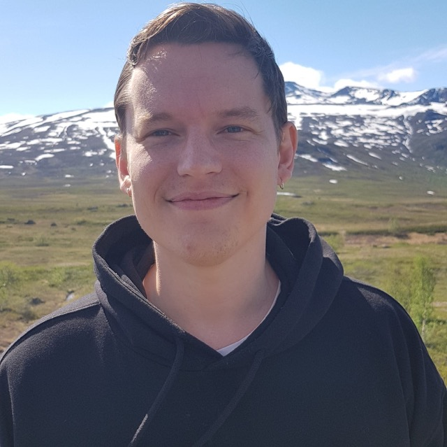
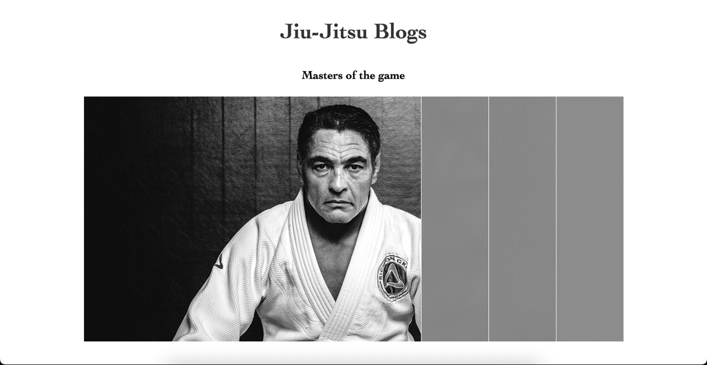

<h2> Hello, there! </h2>

### About me:

<em>My name is Morten Ramfjord, and I am currently studying front-end development at <a href="http://www.noroff.com">Noroff University</a></em>

</a>

<em>You can also visit my <a href="https://ramfjord-portfolio.netlify.app/">Portfolio
</em>

 

### Connect with me at:

Codepen:

Email: **Morten.Ramfjord@gmail.com**

 

### Languages and Tools I am currently working with:

    
    
    
     
    
    

 

## 🗂️ Highlighted Project

 

<h3>Follow me:</h3>

